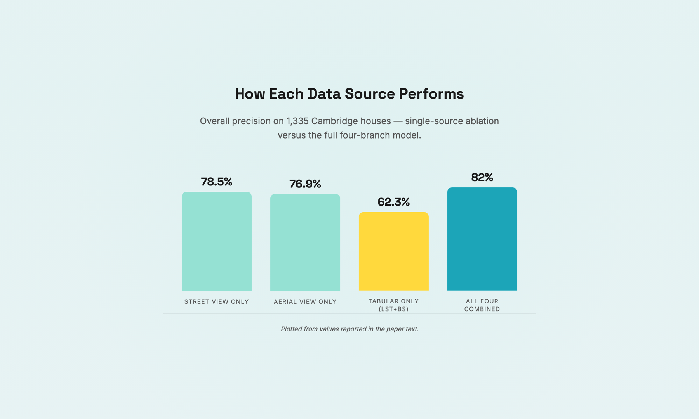

# SCS — Identifying Hard-to-Decarbonize houses

A rendered storyboard for:

> Sun, M. & Bardhan, R. (2024). **Identifying Hard-to-Decarbonize houses from multi-source data in Cambridge, UK.** *Sustainable Cities and Society* 100, 105015. [doi:10.1016/j.scs.2023.105015](https://doi.org/10.1016/j.scs.2023.105015)

A deep learning model that fuses Street View Images (SVI), Aerial View Images (AVI), Land Surface Temperature (LST) and building stock data to classify which Cambridge houses are hardest to decarbonize, reaching 82% precision and falling back gracefully to 77% on aerial imagery alone — making the approach portable to cities without street-view coverage.

## Style combo

- **palette**: `cool`
- **mode**: `light`
- **typography**: `modern` (Space Grotesk + Inter)
- **cover**: AI-generated via `gpt-image-1` (`cover.png`)

## Layouts used

`title → split → split_reverse → split → chart → split → comparison → quote → credits` — demonstrates 7 of the layouts in one page.

The `keyFinding` slot uses the **`chart`** layout — a vanilla (no-CDN) bar chart whose bars grow on scroll and reveal exact values on hover/focus. The four ablation precision values are lifted verbatim from the paper, so the chart carries a `"data_source": "text"` provenance caption. (Charts built from numbers eyeballed off a figure should set `"data_source": "estimated"`, which renders an "approximate, not exact" warning instead.)



## View it

Open `index.html` directly in a browser, or from the repo root:

```bash
python3 skill/scripts/preview.py examples/SCS_storyboard 8765
```

## Re-render

`storyboard.json` is the editable narrative. After edits:

```bash
python3 skill/scripts/render.py \
  --storyboard examples/SCS_storyboard/storyboard.json \
  --palette cool --mode light --typography modern \
  --out examples/SCS_storyboard
```
